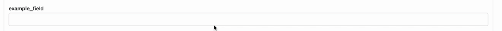
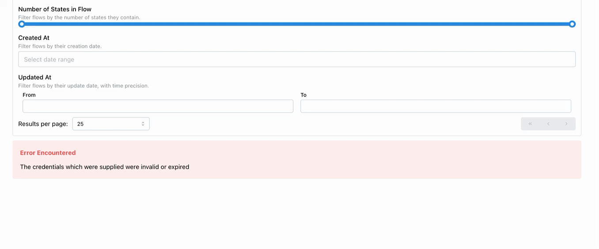

# static-search-portal

**⚠️ IMPORTANT ⚠️** You only need to interact with **this** repository if you are improving the `generator` or using this code to start a self-managed project. If you want to deploy a search portal, copy our [template-search-portal](https://github.com/globus/template-search-portal) and modify the `static.json` file to suit your needs.

---

- [static.json Type Documentation](/docs/type-aliases/Static.md)

---

This is a [Next.js](https://nextjs.org/) project bootstrapped with [`create-next-app`](https://github.com/vercel/next.js/tree/canary/packages/create-next-app).

## Features

### Globus Search

The primary goal of this generator is to provide a simple interface to a [Globus Search](https://docs.globus.org/api/search/) Index.

The `data.attributes.globus.search` configuration supports a number of properties that can be used to customize the default experience.

### Filters (`data.attributes.globus.search.filters`)

Provide filter controls to your users by configuring filters. The configuration object takes on the shape of [`GFilter`](https://docs.globus.org/api/search/reference/post_query/#gfilter) combined with a `ui` member to allow even more customization of the filter component.

#### `match_any` / `match_all`



```json
{
  "field_name": "example_field",
  "type": "match_any"
}
```

```json
{
  "field_name": "example_field",
  "type": "match_all"
}
```

```json
{
  "field_name": "example_field",
  "type": "match_all",
  "ui": {
    "label": "Example Field",
    "description": "Filter flows by matching any of the specified values in this field."
  }
}
```

#### `range`



```json
{
  "field_name": "number_of_states_in_flow",
  "type": "range",
  "ui": {
    "label": "Number of States in Flow",
    "description": "Filter flows by the number of states they contain.",
    "min": 1,
    "max": 100
  }
}
```

##### Support `ui.type` Values

```json
{
  "field_name": "created_at",
  "type": "range",
  "ui": {
    "type": "date",
    "label": "Created At",
    "description": "Filter flows by their creation date."
  }
}
```

```json
{
  "field_name": "updated_at",
  "type": "range",
  "ui": {
    "type": "datetime",
    "label": "Updated At",
    "description": "Filter flows by their update date, with time precision."
  }
}
```

### Facets (Facet-based Filters) (`data.attributes.globus.search.facets`)

### Boosts (`data.attributes.globus.search.boosts`)
